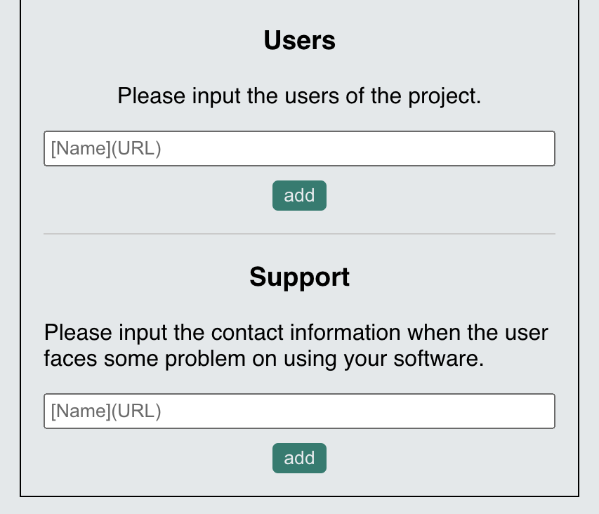

# LEADYOU

<!-- # Short Description -->

`LEADYOU` is a web application that helps you to write a `README` easily.

LEADYOU automatically fills several parts contents such as Project Name, Short Description, and Badges.
Additionally you can fill other items we recommend you to fill (Tags, Advantages, Installation, Minimal Example are recommended items).

<!-- # Badges -->

[](https://github.com/Hacknock/leadyou/issues)
[](https://github.com/Hacknock/leadyou/network/members)
[](https://github.com/Hacknock/leadyou/stargazers)
[](https://github.com/Hacknock/leadyou/)
[](https://github.com/Hacknock/leadyou/)

# Tags

`README` `GitHub` `Markdown` `Web Components` `MariaDB` `Docker`

# Demo

**Just follow the flow of input to create a rich document** 🎉


# Advantages

1. You can clarify what to write README because LEADYOU gives you specific items to write.
2. LEADYOU supports you to write README with auto-fill function.
3. Easy to insert demo images because LEADYOU automatically generates necessary links after uploading images to LEADYOU.

# Installation

LEADYOU needs docker-engine, docker-compose, and a personal access token of GitHub.
If you need to install docker-engine and docker-compose, the following websites might be helpful.

- [How to install Docker Engine](https://docs.docker.com/engine/install/ubuntu/)
- [How to install Docker Compose](https://docs.docker.com/compose/install/)

You can get a personal access token [here](https://docs.github.com/en/authentication/keeping-your-account-and-data-secure/creating-a-personal-access-token).

Please download this repository before deploying.

```sh
git clone git@github.com:Hacknock/leadyou.git
```

or

```sh
git clone https://github.com/Hacknock/leadyou.git
```

# Deployment

You need to fill some items of the environment values setting file before deploying.
Make the `.env` file on the top-level directory and set the following items.

### Environment File Setting

**.env**

`.env` file has a setting parameter. If you face a problem setting each parameter, please refer to [Docker MariaDB image official page](https://hub.docker.com/_/mariadb).

```
MYSQL_ROOT_PASSWORD=[Set mariadb ROOT password]
MYSQL_DATABASE=[Set database name]
MYSQL_USER=[Set user name]
MYSQL_PASSWORD=[Set USER password]
MYSQL_PORT=[Set MARIADB port number]
CON_LIMIT=[Set connection limitation number]
WEB_PORT=[Set APPLICATION port number]
GITHUB_TOKEN=[Set GitHub personal access token]
```

Recommendation value

```
MYSQL_PORT=3306
CON_LIMIT=5
WEB_PORT=3000
```

### Test

We prepare the test code to check the connection between the app and MariaDB. Please run the following command.

```sh
sudo docker-compose -f docker-compose.yml -f ./docker/test.yml up --build --abort-on-container-exit
```

### Deploy

Please run the following command on the top-level directory of this repository.

**Run with log output**

```sh
sudo docker-compose up --build
```

Please type `ctrl+c` if you close docker.

**Run without log output (daemon)**

Please execute the following command if you run LEADYOU in daemon mode.

```sh
sudo docker-compose up --build -d
```

Please execute the following command if you want to stop LEADYOU.

```sh
sudo docker-compose stop
```

**Run without log output and keep storage on host OS**
This mode enables to keep storage which includes issued README data. This data is used for displaying the README catalogs on the top page.

```sh
sudo docker-compose -f docker-compose.yml -f ./docker/production.yml up --build -d
```

Please execute the following command if you want to stop LEADYOU.

```sh
sudo docker-compose stop
```

**How to access LEADYOU after deployment**

After deployment, you access `http://localhost:[Port number you set]`.
You should be able to access LEADYOU on your local PC.

# Minimal Example

You can add or delete some items to make README using this repository source code.
For example, you want to add "Support".
This item will help your colleagues ask you when they will face a problem with using your software.
You add the following code on lines 178 to 191 of `/app/public/public/plugins/template.json`.

```json
{
  "title": "Support",
  "hiddenTitle": false,
  "required": false,
  "replacement": false,
  "multiple": true,
  "component": "wrap-oneline-field",
  "description": "Please input the contact information when the user faces some problem on using your software.",
  "kindsOfValues": ["plain"],
  "formats": ["- %s\n"],
  "attributes": {
    "placeholder": "[Name](URL)"
  }
}
```

You deploy it again, Support item will be on edit form like this screenshot. 🍻



# Contributors

- [KASHIHARAAkira](https://github.com/KASHIHARAAkira)
- [Kyome22](https://github.com/Kyome22)

<!-- CREATED_BY_LEADYOU_README_GENERATOR -->
