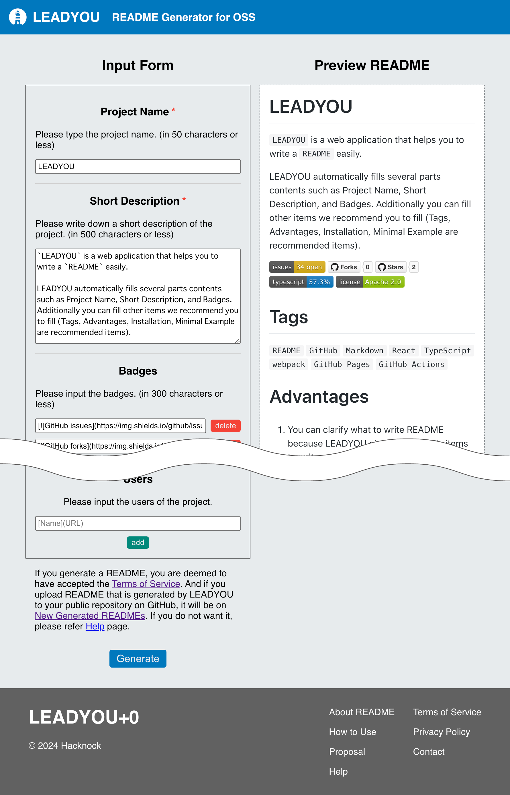

# readme-generator-plugins

The README Generator offers an open source README format and a form application that allows you to write it. It is required that all developer can propose necessary items of README and user interface of README Generator. Therefore, we make a system that enables you to propose new README format and form application by fork this project and edit it.

# Tags
`README` `JavaScript` `WebComponents` `CSS` `custom elements `

# Advantages
- You don't need to consider form application structure, just only edit javascript, json and markdown files.

# Installation
You just fork this project and clone it.

# Minimal Example

For example, current README generator consists of four custom elements and four custom scripts.

# Contributors
- [KASHIHARAAkira](https://github.com/KASHIHARAAkira)
- [Kyome22](https://github.com/Kyome22)

